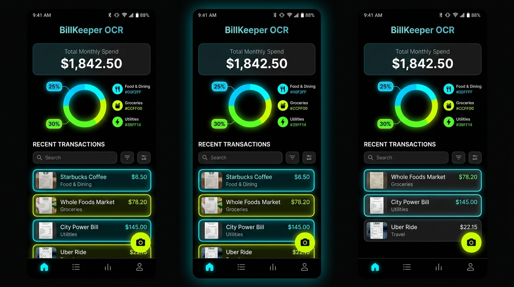
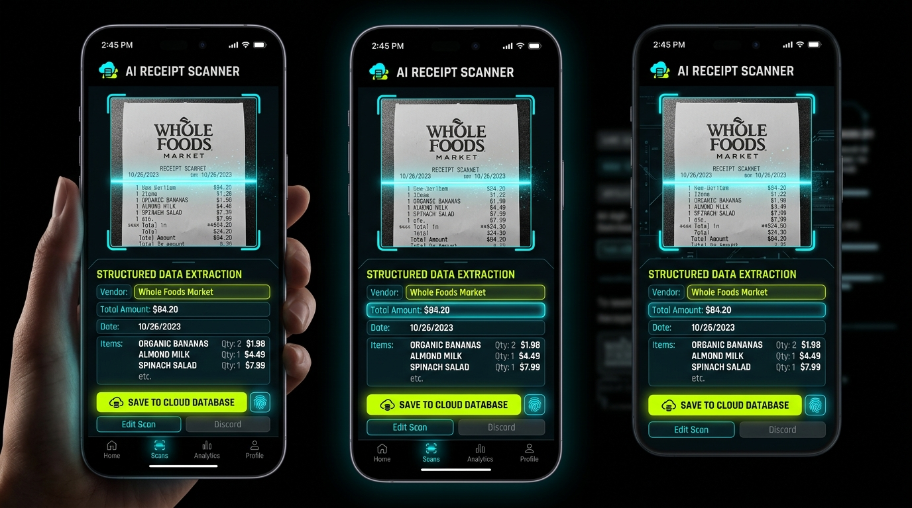
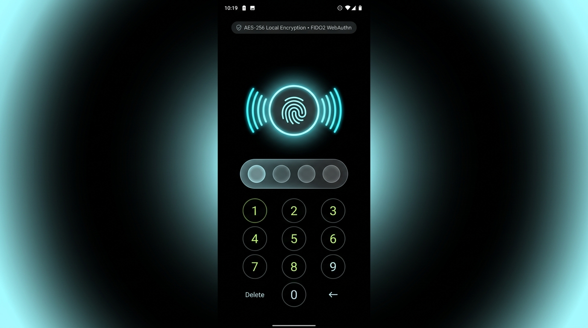

# BillKeeper OCR 🧾⚡

> **Intelligent bill bookkeeping & receipt scanner with AI-powered OCR, offline-first sync, biometric security, and monthly spending analytics.**

[](https://opensource.org/licenses/Apache-2.0)
[](https://reactjs.org/)
[](https://www.typescriptlang.org/)
[](https://tailwindcss.com/)
[](https://ai.google.dev/)
[](https://webauthn.io/)

---

## 📱 User Interface & Visual Showcase

### 1. Monthly Spending Dashboard & Visualizations
Comprehensive overview of monthly spending patterns, budget distribution, high-contrast category charts, and recent transaction history.

<p align="center">
  
</p>

* **Total Spend Analytics**: Real-time aggregation of current month's expenses, transaction count, average bill size, and top expense categories.
* **Interactive Spending Breakdown**: Custom SVG donut chart with category distribution and percentage share.
* **Category Progress Tracking**: High-contrast progress indicators for Food & Dining, Groceries, Utilities, Shopping, Travel, and Health.
* **Filterable Transactions**: Instant search by merchant, date, or category with receipt thumbnail previews.

---

### 2. AI Receipt Scanner & OCR Line-Item Extraction
Snap a photo with your device camera or upload receipt screenshots to automatically extract merchant names, amounts, taxes, and itemized line items using Google Gemini AI.

<p align="center">
  
</p>

* **Flexible Capture**: Choose between Live Device Camera, File Upload / Drag & Drop, or pre-loaded sample receipts for instant testing.
* **Laser HUD Animation**: Interactive scanning state with neural OCR visual indicators.
* **Automatic Field Detection**: Automatically extracts vendor/merchant, total amount, taxes, transaction date, payment method, and line items.
* **Manual Correction & Review**: Full ability to edit or add line items, adjust quantities and unit prices before saving.

---

### 3. Biometric Authentication & Account Security
Protect sensitive financial records with Android-style biometric authentication (fingerprint / Face ID via FIDO2 WebAuthn) and 4-digit PIN fallback.

<p align="center">
  
</p>

* **Hardware Fingerprint / Face ID**: Uses the Web Authentication API (`navigator.credentials`) to challenge the user's authenticators.
* **PIN Passcode Fallback**: 4-digit numeric keypad with tactile response and auto-verification (default demo PIN: `1234`).
* **Auto-Lock Timer**: Configurable security lock timeout (Immediate, 1 min, 5 min, 15 min, or Disabled) for privacy protection.

---

## 🚀 Key Features

| Feature | Description |
| :--- | :--- |
| **🤖 Gemini AI OCR** | Extracts merchant names, total amounts, dates, tax breakdown, and individual line items from bill photos using server-side Gemini 3.8 Flash. |
| **📊 Spending Dashboard** | Visualizes spending distribution with dynamic SVG donut charts, monthly trends, and category budget progress bars. |
| **📶 Offline-First Engine** | Operates seamlessly without internet connection. Scans and saves locally to an offline sync queue, auto-syncing when network returns. |
| **🔐 Biometric Lock** | Native-grade hardware biometric authentication (Fingerprint, TouchID, FaceID) with fallback PIN entry. |
| **🔍 Search & Filter** | Fast client-side filtering across merchants, transaction notes, dates, and category tags. |
| **🎨 Immersive UI** | High-contrast dark theme (`#050505`) with electric cyan (`#00F2FF`) and lime (`#CCFF00`) accents, fluid glassmorphism, and responsive mobile layout. |
| **💾 Export & Backup** | One-click JSON backup export and data reset capabilities in Settings. |

---

## 🛠️ Architecture & Tech Stack

```
billkeeper-ocr/
├── server.ts                 # Express full-stack proxy & Gemini OCR API endpoint
├── src/
│   ├── components/
│   │   ├── AndroidStatusBar.tsx     # Android system status bar (battery, wifi, clock)
│   │   ├── AndroidBottomNav.tsx     # Floating bottom navigation bar
│   │   ├── SpendingDashboard.tsx    # Donut charts, category breakdown & spending stats
│   │   ├── BookkeepingList.tsx      # Bill list, search, filters & bill detail modal
│   │   ├── ReceiptScannerModal.tsx  # Camera stream, file dropzone & OCR review
│   │   ├── BiometricLockScreen.tsx  # Fingerprint & PIN code security lock
│   │   └── SettingsModal.tsx        # Offline mode toggles, biometrics & data export
│   ├── data/
│   │   ├── categories.ts            # Category taxonomies and Immersive UI palette
│   │   ├── initialBills.ts          # Seed bookkeeping records
│   │   └── sampleReceipts.ts        # Instant test receipts for one-click OCR demo
│   ├── utils/
│   │   ├── biometrics.ts            # WebAuthn / FIDO2 challenge & PIN verification
│   │   └── storage.ts               # LocalStorage persistent sync queue & offline state
│   ├── App.tsx                      # Root state manager & Android shell wrapper
│   └── types.ts                     # Strict TypeScript interfaces & models
└── public/
    └── screenshots/                 # Application visual documentation
```

### Backend & API
* **Node.js & Express**: Provides clean server-side endpoints to keep API keys secure.
* **`@google/genai` (Gemini 3.8 Flash)**: High-speed multimodal visual parser extracting structured JSON data directly from base64 bill images.

### Frontend
* **React 18 + Vite**: Lightning-fast client-side reactive interface with zero build lag.
* **Tailwind CSS v4**: Hardware-accelerated styling with modern CSS variables, backdrop blur filters, and responsive layouts.
* **Lucide React**: Clean, accessible iconography.

---

## ⚡ Quick Start & Installation

### Prerequisites
* [Node.js](https://nodejs.org/) (version 18.0.0 or higher)
* [npm](https://www.npmjs.com/) (version 9.0.0 or higher)
* A [Google Gemini API Key](https://aistudio.google.com/app/apikey)

### 1. Clone the repository
```bash
git clone https://github.com/your-username/billkeeper-ocr.git
cd billkeeper-ocr
```

### 2. Install dependencies
```bash
npm install
```

### 3. Configure environment variables
Create a `.env` file based on `.env.example`:
```bash
cp .env.example .env
```
Add your Gemini API key:
```env
GEMINI_API_KEY=your_actual_gemini_api_key_here
```

### 4. Start development server
```bash
npm run dev
```
Open your browser and navigate to `http://localhost:3000`.

---

## 📡 API Reference

### `POST /api/ocr`
Processes a receipt or bill screenshot and returns structured bookkeeping metadata.

#### Request Body
```json
{
  "imageBase64": "data:image/jpeg;base64,...",
  "mimeType": "image/jpeg"
}
```

#### Response (200 OK)
```json
{
  "merchant": "Trader Joe's",
  "date": "2026-09-02",
  "totalAmount": 64.30,
  "currency": "$",
  "taxAmount": 4.50,
  "category": "Groceries",
  "paymentMethod": "Apple Pay (Visa *4921)",
  "confidenceScore": 98,
  "lineItems": [
    { "description": "Organic Almond Milk", "quantity": 2, "unitPrice": 3.99, "total": 7.98 },
    { "description": "Sourdough Bread", "quantity": 1, "unitPrice": 4.50, "total": 4.50 }
  ],
  "notes": "Verified grocery purchase",
  "rawText": "TRADER JOE'S #142\nTOTAL: $64.30..."
}
```

---

## 📴 Offline Mode & Sync Strategy

1. **Local-First Persistence**: All bills are stored in the client-side database with immediate read/write access.
2. **Network Detection**: Listens to browser `online` and `offline` events. Users can also manually toggle simulated offline mode in Settings.
3. **Queue Synchronization**: When offline, new bills are labeled as `pending_sync`. As soon as connectivity is restored, the queue is synced to the cloud database with status badges updated to `synced`.

---

## 🔒 Security & Biometrics

* **FIDO2 / WebAuthn**: Cryptographic challenge ensures genuine local biometric verification.
* **No Server Storage of Biometrics**: Biometric verification is handled strictly on-device by the operating system / browser authenticator.
* **PIN Fallback**: Default PIN is `1234` (customizable in app settings).
* **API Key Protection**: All AI calls are routed through server-side proxies, preventing credential exposure to the client.

---

## 📄 License
This project is licensed under the Apache License 2.0. See [LICENSE](LICENSE) for details.
